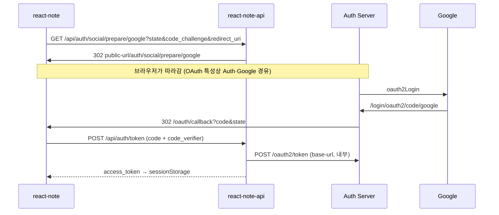

## 목차

<TOCInline toc={props.toc} exclude="목차"/>

---

> [이전 글](/blog/virtualMachine/vm00010)까지 **EC2 + k3s + Argo + Jenkins** 로 앱 3개를 올려 두었습니다.<br/>
> 이번엔 **로컬 로그인(아이디/비밀번호)** 에 더해 **Google SNS 로그인**을 붙인 기록입니다.<br/>
> 원칙: **프론트는 Auth Server(9000)를 직접 모른다** → 항상 **API(BFF)만** 호출합니다.

## 1. 로컬 로그인 vs Google 로그인

| | 로컬 로그인 | Google SNS |
|---|------------|------------|
| 시작 | `/login` 폼 | Google 버튼 클릭 |
| 프론트 → API | `POST /api/auth/login` | `GET /api/auth/social/prepare/google` |
| API → Auth | `/auth/login` | 302 redirect → `/auth/social/prepare/...` |
| 토큰 | 응답에 `access_token` | `/oauth/callback` → `POST /api/auth/token` |
| 브라우저가 Auth URL 직접 호출 | ❌ | ❌ (진입은 API만) |

로컬 로그인은 이미 BFF만 쓰고 있었고, Google도 **같은 원칙**으로 맞췄습니다.

## 2. 전체 흐름 (한 장)



**왜 브라우저가 Auth를 한 번 거치나?**  
Google OAuth는 **브라우저 redirect**가 필수입니다. BFF가 `sendRedirect`로 넘기면, 그다음 요청 주체는 **사용자 브라우저**입니다.  
그래서 k8s에서는 Auth 주소를 **두 개** 둡니다.

| 설정 | 용도 | k8s 예시 |
|------|------|----------|
| `base-url` | BFF Pod → Auth (login, token, jwks) | `http://auth-server.note.svc.cluster.local:9000/authorization-api` |
| `public-url` | 브라우저 redirect (SNS prepare) | `https://auth.{EC2_IP}.nip.io/authorization-api` |

로컬은 둘 다 `http://localhost:9000/authorization-api` 로 같습니다.

## 3. repo별로 뭐가 생겼나

### 3-1. spring-authorization-server (Auth :9000)

| 파일 | 역할 |
|------|------|
| `SocialLoginPrepareController` | `/auth/social/prepare/{provider}` — PKCE 3종을 **세션**에 저장 후 `/oauth2/authorization/google` 로 redirect |
| `SocialLoginSuccessHandler` | Google 로그인 성공 후 **SAS authorization code** 발급 → SPA `redirect_uri` 로 redirect |
| `SocialLoginAttributes` | 세션 키 상수 (`state`, `code_challenge`, `redirect_uri`) |
| `AppConfig` | `react-note` RegisteredClient (PKCE 필수) |
| `application.yml` | `GOOGLE_CLIENT_ID` / `GOOGLE_CLIENT_SECRET` env |

**Google이 주는 code**와 **우리가 SPA에 주는 code**는 다릅니다.

| code | 누가 발급 | 어디서 씀 |
|------|---------|----------|
| Google authorization code | Google | Auth 내부 `/login/oauth2/code/google` (Spring Client 자동) |
| SAS authorization code | `SocialLoginSuccessHandler` | SPA `/oauth/callback` → BFF token 교환 |

### 3-2. react-note-api (BFF :8082)

| 추가 | 역할 |
|------|------|
| `GET /api/auth/social/prepare/{provider}` | 프론트 진입점 → Auth `public-url` 로 302 |
| `POST /api/auth/token` | (기존) code + `code_verifier` → Auth `/oauth2/token` |

`AuthServerClient` 가 `base-url`로 서버 간 호출, `public-url`로 브라우저 redirect URL을 만듭니다.

### 3-3. react-note (프론트 :8080)

| 파일 | 역할 |
|------|------|
| `snsLogin.js` | PKCE 생성 → `BASE_API_URL/api/auth/social/prepare/...` 로 이동 |
| `OAuthCallbackView` | `exchangeToken` → `sessionStorage` |
| `.env` | `VITE_BASE_API_URL`, `VITE_OAUTH_REDIRECT_URI` 만 (**Auth URL 없음**) |

## 4. Google Cloud Console 설정

**클라이언트 유형: 웹 애플리케이션** (Desktop 아님)

**승인된 리디렉션 URI** (Auth Server 쪽 — Spring이 자동 처리):

```
로컬: http://localhost:9000/authorization-api/login/oauth2/code/google
EC2:  https://auth.{EC2_IP}.nip.io/authorization-api/login/oauth2/code/google
```

`/login/oauth2/code/google` 은 **Spring OAuth2 Client**가 만드는 고정 패턴입니다. `@Controller`로 직접 만들 필요 없습니다.

**OAuth 동의 화면** → 테스트 단계면 **테스트 사용자**에 본인 Gmail 추가.

**Auth Server env** (로컬은 export 또는 IDE, EC2는 k8s Secret):

```bash
GOOGLE_CLIENT_ID=...
GOOGLE_CLIENT_SECRET=...
```

EC2 Secret 예시 (`*.secret.yaml` → gitignore, `kubectl apply`):

```yaml
apiVersion: v1
kind: Secret
metadata:
  name: auth-server-google
  namespace: note
stringData:
  client-id: "..."
  client-secret: "..."
```

## 5. 로컬에서 돌려보기

```bash
# 터미널 3개
# :8080 yarn dev
# :8082 API
# :9000 Auth (GOOGLE_CLIENT_ID/SECRET 설정)
```

`.env` (프론트):

```
VITE_BASE_API_URL=http://localhost:8082
VITE_OAUTH_REDIRECT_URI=http://localhost:8080/oauth/callback
```

1. 로그인 화면 → **Google** 클릭  
2. Google 계정 선택  
3. `http://localhost:8080/oauth/callback?code=...` → 홈으로 이동  
4. DevTools → Application → sessionStorage 에 `access_token`

## 6. EC2 반영 시

| 대상 | 작업 |
|------|------|
| auth-server | Google OAuth 코드 + Secret (`auth-server-ci` 또는 수동 이미지) |
| react-note-api | `/api/auth/social/prepare` + ConfigMap `AUTH_SERVER_BASE_URL` / `PUBLIC_URL` |
| react-note | `snsLogin` API 경유 빌드 (`react-note-ci`) |
| react-note-deploy | `configmap-api.yaml`, `auth-server.yaml` env |

ConfigMap 예:

```yaml
AUTH_SERVER_BASE_URL: "http://auth-server.note.svc.cluster.local:9000/authorization-api"
AUTH_SERVER_PUBLIC_URL: "https://auth.13.239.220.205.nip.io/authorization-api"
```

## 7. 삽질 모음

| 증상 | 원인 / 해결 |
|------|-------------|
| `OAuth2AuthorizationCode` import 에러 | 패키지는 `oauth2.core` 가 아니라 `oauth2.server.authorization` |
| `PkceParameterNames` | `CODE_CHALLENGE` 는 `OAuth2ParameterNames` 에 없음 |
| 프론트가 Auth URL 직접 호출 | `snsLogin.js` → BFF `/api/auth/social/prepare` 로 변경 |
| redirect에 내부 DNS 넣으면 안 됨 | `sendRedirect` 는 **브라우저**가 따라감 → `public-url` 필수 |
| Google Desktop client | **웹 애플리케이션**으로 다시 생성 |
| EC2 Pod `CreateContainerConfigError` | `auth-server-google` Secret 미적용 |

## 8. 배운 것

1. **SNS도 BFF 게이트** — 프론트 env에 Auth URL 두지 않는다  
2. **OAuth redirect ≠ 서버 간 호출** — `base-url` / `public-url` 분리 이유  
3. **Google code ≠ SAS code** — `SocialLoginSuccessHandler` 가 SPA용 code 브릿지  
4. **`react-note` 클라이언트** — `AppConfig` 에 코드 등록 (Google Console과 별개)  
5. **PKCE** — prepare 단계에서 세션에 `code_challenge`, callback 에서 `code_verifier` 검증

## 9. 시리즈 링크

| 글 | 내용 |
|----|------|
| [vm00008](/blog/virtualMachine/vm00008) | EC2 + k3s 첫 배포 |
| [vm00009](/blog/virtualMachine/vm00009) | Argo CD GitOps |
| [vm00010](/blog/virtualMachine/vm00010) | Jenkins CI |
| **vm00011** (이 글) | Google SNS 로그인 |

---

**다음에 할 것:** EC2에서 Google 로그인 E2E 확인, refresh token (선택), Kakao/Naver
