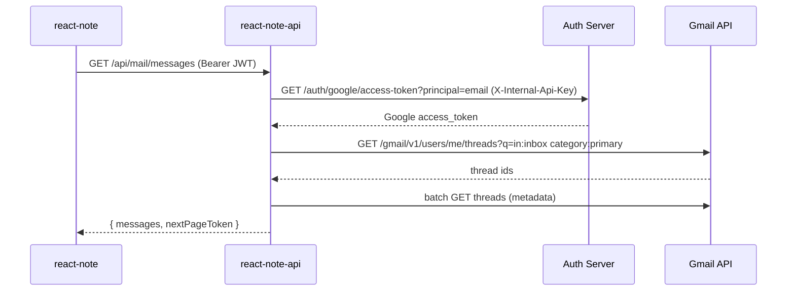
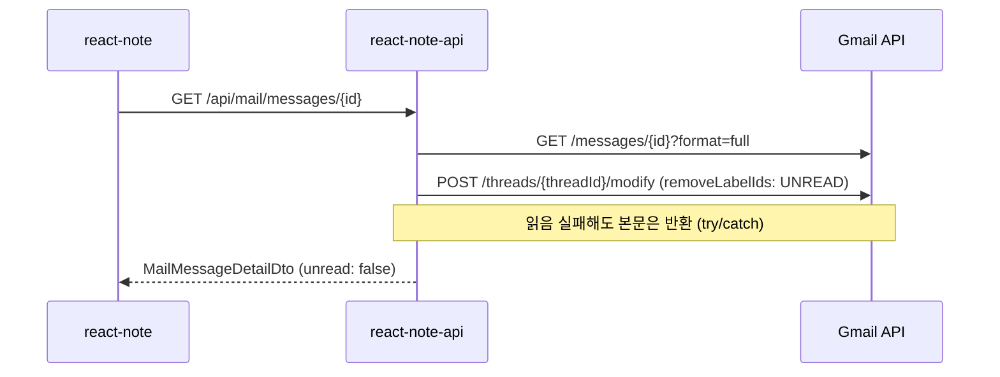
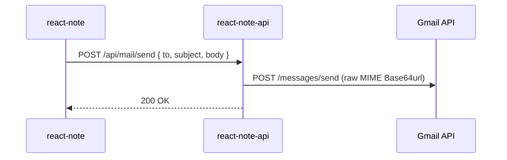

## 목차

<TOCInline toc={props.toc} exclude="목차"/>

---

> [이전 글(vm00011)](/blog/virtualMachine/vm00011)에서 **Google SNS 로그인**까지 붙여 두었습니다.<br/>
> 이번엔 같은 Google 계정으로 **Gmail 웹메일**을 react-note 안에서 보고, 읽고, 보내는 기능을 붙인 기록입니다.<br/>
> 원칙은 그대로입니다. **프론트는 Gmail API를 직접 호출하지 않는다** → **BFF(:8082)만** 경유합니다.

## 1. 왜 Gmail API를 프론트에서 안 부르나?

| 방식 | 문제 |
|------|------|
| 프론트 → Gmail API | Google access token이 브라우저에 노출됨 |
| 프론트 → Auth Server 직접 | 아키텍처 규칙 위반 (프론트는 BFF만) |
| **프론트 → BFF → Auth → Gmail** | ✅ 토큰은 서버에만, SPA는 JWT만 |

Gmail용 **Google access token**은 Auth Server의 `OAuth2AuthorizedClientService`에 저장하고, BFF가 **내부 API**로 꺼내 씁니다.

```
SPA (react-note :8080)
  │  Bearer JWT (우리 앱 access_token)
  ▼
BFF (react-note-api :8082)
  │  X-Internal-Api-Key + principal
  ▼
Auth Server (:9000)  →  Google access token 반환
  │
  ▼
Gmail API (googleapis.com)
```

로컬 로그인(아이디/비밀번호)만 한 사용자는 Gmail scope가 없으므로 메일 화면에서 **Google 재로그인**을 안내합니다.

## 2. 전체 흐름 (한 장)

### 2-1. 메일 목록 조회



### 2-2. 메일 상세 + 읽음 처리



### 2-3. 메일 발송



## 3. Gmail scope — 점진적으로 붙이기

Auth Server `application.yml`의 Google registration scope:

```yaml
spring:
  security:
    oauth2:
      client:
        registration:
          google:
            scope:
              - openid
              - profile
              - email
              - https://www.googleapis.com/auth/gmail.readonly   # 목록·본문 읽기
              - https://www.googleapis.com/auth/gmail.send       # 발송
              - https://www.googleapis.com/auth/gmail.modify     # 읽음 처리(UNREAD 제거)
```

| scope | 용도 |
|-------|------|
| `gmail.readonly` | 받은편지함 목록, 본문 조회 |
| `gmail.send` | 메일 작성·발송 |
| `gmail.modify` | 스레드 읽음 처리 (`threads.modify`) |

**이미 Google로 로그인한 적이 있는 사용자**는 scope가 늘어난 뒤 **다시 동의(재로그인)** 해야 합니다.  
Auth Server `OAuth2ClientConfig`에서 Google 요청에 아래를 붙여 refresh token·재동의를 유도합니다.

```java
params.put("access_type", "offline");
params.put("prompt", "consent");
```

## 4. Google Cloud Console 설정

[vm00011](/blog/virtualMachine/vm00011)에서 OAuth 클라이언트(웹 애플리케이션)는 이미 만들어 두었다고 가정합니다. **추가로** Gmail API를 켭니다.

### 4-1. Gmail API 활성화

1. [Google Cloud Console](https://console.cloud.google.com/) → 프로젝트 선택
2. **API 및 서비스** → **라이브러리**
3. **Gmail API** 검색 → **사용** 클릭

### 4-2. OAuth 동의 화면

1. **API 및 서비스** → **OAuth 동의 화면**
2. 테스트 단계면 **테스트 사용자**에 본인 Gmail 추가
3. scope 추가 시 Gmail 관련 scope가 목록에 보이는지 확인

### 4-3. 리디렉션 URI (변경 없음)

Gmail 연동은 **redirect URI 추가가 필요 없습니다**. 기존 Spring OAuth2 Client callback 그대로 사용합니다.

```
로컬: http://localhost:9000/authorization-api/login/oauth2/code/google
EC2:  https://auth.{EC2_IP}.nip.io/authorization-api/login/oauth2/code/google
```

### 4-4. Auth Server 환경 변수

```bash
GOOGLE_CLIENT_ID=...
GOOGLE_CLIENT_SECRET=...
AUTH_INTERNAL_API_KEY=dev-internal-key   # BFF ↔ Auth 내부 호출용 (로컬 기본값)
```

EC2 Secret 예시 (`auth-server-google` — vm00011과 동일):

```yaml
apiVersion: v1
kind: Secret
metadata:
  name: auth-server-google
  namespace: note
stringData:
  client-id: "..."
  client-secret: "..."
```

## 5. repo별 구현 상세

### 5-1. spring-authorization-server (Auth :9000)

#### Google Gmail 토큰 보관·조회

Google 로그인 성공 시 Spring Security OAuth2 Client가 **Google access/refresh token**을 `OAuth2AuthorizedClientService`에 저장합니다.  
BFF는 이 토큰을 직접 못 읽으므로 **내부 전용 API**를 엽니다.

| 파일 | 역할 |
|------|------|
| `GoogleGmailTokenService` | principal(이메일)로 Google client 로드, 만료 60초 전이면 refresh |
| `GoogleGmailTokenController` | `GET /auth/google/access-token?principal=` — `X-Internal-Api-Key` 검증 |
| `OAuth2ClientConfig` | `refreshToken` provider + Google `access_type=offline`, `prompt=consent` |

**내부 API**

```
GET /authorization-api/auth/google/access-token?principal={email}
Header: X-Internal-Api-Key: {AUTH_INTERNAL_API_KEY}

200 → { "accessToken": "ya29..." }
404 → { "code": "GOOGLE_GMAIL_NOT_LINKED" }
401 → API Key 불일치
```

**principal 이름**은 Google SNS 로그인 시 `SocialLoginSuccessHandler`가 **이메일**로 맞춥니다 (`OidcUser.getEmail()`).  
BFF의 JWT `sub`와 동일해야 토큰을 찾을 수 있습니다.

### 5-2. react-note-api (BFF :8082)

#### BFF API 엔드포인트

| Method | Path | 설명 |
|--------|------|------|
| `GET` | `/api/mail/messages?folder=inbox&pageToken=` | 메일 목록 (페이징) |
| `GET` | `/api/mail/messages/{id}` | 상세 + 읽음 처리 |
| `GET` | `/api/mail/folders` | 폴더별 배지 수 |
| `POST` | `/api/mail/send` | 발송 |

모두 **JWT 인증 필수** (`SecurityConfig`: `/api/**` → `authenticated`).

#### MailService 흐름

```java
// 1) JWT subject(principal)로 Google token 조회
String googleToken = authServerClient.fetchGoogleAccessToken(principal);

// 2) Gmail API 호출
return gmailClient.listMessages(googleToken, folder, maxResults, pageToken);
```

`AuthServerClient.fetchGoogleAccessToken()`:

- `auth-server.base-url` + `/auth/google/access-token`
- Header `X-Internal-Api-Key`
- 404 → `MailGoogleNotLinkedException` → 프론트에 `MAIL_GOOGLE_NOT_LINKED`

#### GmailClient 핵심 설계

| 항목 | 구현 |
|------|------|
| 목록 단위 | `messages`가 아니라 **`threads`** (Gmail 웹과 동일) |
| 받은편지함 목록 | Gmail 검색 `in:inbox category:primary` (기본 탭) |
| 받은편지함 배지 | `in:inbox category:primary is:unread` 스레드 수 |
| 보낸편지함 | `labelIds=SENT` |
| 임시보관함 | `labelIds=DRAFT` |
| 목록 성능 | `threads.list` + **batch** metadata 조회 |
| 본문 | `format=full`, HTML 우선 → plain fallback |
| 한글 제목 | MIME Subject UTF-8 Base64 인코딩 (`=?UTF-8?B?...?=`) |
| 읽음 | `POST /threads/{id}/modify` — `removeLabelIds: ["UNREAD"]` |
| 발송 | raw MIME → Base64url → `POST /messages/send` |
| RestTemplate | UTF-8 (한글 깨짐 방지) |

**응답 DTO**

```json
// GET /api/mail/messages
{
  "messages": [
    {
      "id": "...",
      "folder": "inbox",
      "from": "사람인",
      "fromEmail": "noreply@saramin.co.kr",
      "subject": "...",
      "preview": "...",
      "date": "오후 01:56",
      "unread": true
    }
  ],
  "nextPageToken": "..."
}
```

```json
// GET /api/mail/messages/{id}
{
  "id": "...",
  "threadId": "...",
  "folder": "inbox",
  "from": "...",
  "fromEmail": "...",
  "to": "...",
  "subject": "...",
  "preview": "...",
  "body": "...",
  "bodyContentType": "text/html",
  "date": "...",
  "unread": false
}
```

#### BFF application.yml

```yaml
server:
  port: 8082

auth-server:
  base-url: http://localhost:9000/authorization-api
  public-url: ${auth-server.base-url}
  internal-api-key: ${AUTH_INTERNAL_API_KEY:dev-internal-key}

spring:
  security:
    oauth2:
      resourceserver:
        jwt:
          jwk-set-uri: ${auth-server.base-url}/oauth2/jwks
```

k8s 프로필(`application-k8s.yml`):

```yaml
auth-server:
  base-url: ${AUTH_SERVER_BASE_URL}
  public-url: ${AUTH_SERVER_PUBLIC_URL}
  internal-api-key: ${AUTH_INTERNAL_API_KEY}
```

`react-note-deploy/k8s/configmap-api.yaml`:

```yaml
AUTH_SERVER_BASE_URL: "http://auth-server.note.svc.cluster.local:9000/authorization-api"
AUTH_SERVER_PUBLIC_URL: "https://auth.13.239.220.205.nip.io/authorization-api"
AUTH_INTERNAL_API_KEY: "dev-internal-key"
```

Auth Server Pod에도 **같은** `AUTH_INTERNAL_API_KEY`가 들어가야 BFF 호출이 통과합니다.

### 5-3. react-note (프론트 :8080)

#### 라우팅

```jsx
// router/MailRoutes.jsx
{ path: "mail", element: <InboxView /> },
{ path: "mail/compose", element: <ComposeView /> },
{ path: "mail/:id", element: <MailDetailView /> },
```

로그인 시 NavigationBar에 **Mail** 메뉴 표시.

#### API 모듈

```javascript
// api/mailAPI.js
listMessages: (folder, pageToken) =>
  httpClient.get("/api/mail/messages", { params: { folder, pageToken } }),
getFolders: () => httpClient.get("/api/mail/folders"),
getMessage: (id) => httpClient.get(`/api/mail/messages/${id}`),
sendMail: (payload) => httpClient.post("/api/mail/send", payload),
```

프론트 env는 **변경 없음** (`VITE_BASE_API_URL`만).

#### 화면 구성

| 파일 | 역할 |
|------|------|
| `InboxView` | 목록 + 무한 스크롤(`IntersectionObserver`) + 폴더 전환 |
| `MailDetailView` | 상세, HTML/Plain 본문, 읽음 후 목록 state 반영 |
| `ComposeView` | 작성·발송 |
| `MailLayout` | 사이드바(받은/보낸/임시) + 배지 |
| `MailHtmlBody` | DOMPurify로 HTML sanitize 후 렌더 |
| `MailPlainBody` | plain text URL linkify |
| `sanitizeMailHtml.js` | XSS 방지, `<a>`에 `target=_blank` |

#### Gmail 미연동 UX

API가 `403` + `code: MAIL_GOOGLE_NOT_LINKED` 를 주면:

```jsx
<Alert variant="warning">
  Gmail 연동이 필요합니다. Google 계정으로 다시 로그인해 주세요.
  <button onClick={() => startSnsLogin("google")}>Google로 로그인</button>
</Alert>
```

로그아웃 시 `/mail` 화면이면 홈(`/`)으로 이동하도록 처리해 두었습니다.

## 6. Gmail UI와 맞춘 세부 사항

Gmail 웹과 최대한 비슷하게 맞춘 부분입니다.

| Gmail | react-note 구현 |
|-------|----------------|
| 받은편지함 **기본(Primary) 탭** 목록 | `q=in:inbox category:primary` |
| 받은편지함 **배지** (소셜·프로모션 제외한 Primary 미읽음) | `q=in:inbox category:primary is:unread` 스레드 count |
| 소셜·프로모션·업데이트 | 사이드바 별도 탭은 **2단계** (나중에 `CATEGORY_*` 확장) |
| 읽음/안읽음 스타일 | 안읽음 bold, 읽음 배경 `#f2f6fc` |
| 스레드 단위 목록 | `threads.list` + 최신 메시지 metadata |

`CATEGORY_PERSONAL` 라벨만 쓰면 Gmail 기본 탭과 **목록이 어긋날 수 있어서**, Gmail 검색 연산자 `category:primary`를 씁니다.

## 7. 로컬에서 돌려보기

### 7-1. 서버 3개 기동

```bash
# :9000 Auth Server (GOOGLE_CLIENT_ID/SECRET, AUTH_INTERNAL_API_KEY)
# :8082 react-note-api
# :8080 yarn dev
```

### 7-2. 프론트 .env

```
VITE_BASE_API_URL=http://localhost:8082
VITE_OAUTH_REDIRECT_URI=http://localhost:8080/oauth/callback
```

### 7-3. 확인 순서

1. **Google로 로그인** (Gmail scope 동의 화면 확인)
2. 상단 **Mail** 클릭 → `/mail`
3. 받은편지함 목록 로드 확인
4. 메일 클릭 → HTML 본문·링크·읽음 처리
5. **메일 쓰기** → 발송 → 보낸편지함

### 7-4. 로컬 로그인만 한 경우

아이디/비밀번호(`1234`) 로그인만 하면 메일 API는 `MAIL_GOOGLE_NOT_LINKED` → Google 재로그인 안내가 뜹니다. **정상 동작**입니다.

## 8. EC2 / k3s 반영

| 대상 | 작업 |
|------|------|
| auth-server | Gmail scope 코드 + `GoogleGmailTokenController` + 이미지 재빌드/배포 |
| react-note-api | `/api/mail/*` + `GmailClient` + ConfigMap `AUTH_INTERNAL_API_KEY` |
| react-note | Mail UI + `mailAPI` 빌드 |
| Google Console | Gmail API **사용** 설정 (프로덕션 전 검수 필요 시 **앱 게시**) |

Jenkins/Argo 파이프라인은 [vm00010](/blog/virtualMachine/vm00010)·[vm00009](/blog/virtualMachine/vm00009)과 동일하게 push → 이미지 갱신 → sync 흐름입니다.

**체크리스트**

- [ ] Auth Pod: `GOOGLE_CLIENT_*` Secret 적용
- [ ] Auth Pod + API Pod: `AUTH_INTERNAL_API_KEY` **동일 값**
- [ ] API ConfigMap: `AUTH_SERVER_BASE_URL`(클러스터 내부), `AUTH_SERVER_PUBLIC_URL`(nip.io)
- [ ] EC2에서 Google 로그인 → Mail E2E

## 9. 삽질 모음

| 증상 | 원인 / 해결 |
|------|-------------|
| `MAIL_GOOGLE_NOT_LINKED` | Google SNS 로그인 안 함, 또는 **scope 추가 전** 로그인 → Google **재로그인** |
| 읽음 처리 안 됨 (Gmail에 반영 X) | `gmail.modify` scope 없음 / 재로그인 필요. BFF는 실패해도 본문은 반환 |
| 목록이 Gmail과 다름 | `INBOX` 전체 vs `category:primary` 혼동 → 검색 쿼리로 통일 |
| 배지 수가 Gmail과 다름 | `INBOX threadsUnread`가 아니라 **Primary 미읽음 스레드** 기준 |
| 한글 제목·본문 깨짐 | RestTemplate UTF-8 + MIME Subject 인코딩 |
| HTML이 태그 문자열로 보임 | plain 우선이 아니라 **HTML 우선** + DOMPurify |
| `403 ACCESS_TOKEN_SCOPE_INSUFFICIENT` (Gmail API) | scope 부족 → Auth `application.yml` scope + 재동의 |
| BFF → Auth 401 | `AUTH_INTERNAL_API_KEY` 불일치 (Auth·API ConfigMap 확인) |
| 로컬 로그인 후 메일 접근 | 의도된 동작 — Gmail은 **Google OAuth 전용** |

## 10. 2단계 로드맵 (참고)

현재는 **1단계: Google Gmail 연동**입니다. 나중에 자체 `@도메인` 메일로 갈 때를 대비해 BFF에 `MailProvider` 추상화를 두는 방향입니다.

```
1단계 (지금)  GmailProvider  → Gmail API
2단계 (나중)  ImapProvider   → 자체 메일 서버 (MX, Mailcow 등)
```

프론트는 `/api/mail/*` 계약만 유지하고, 백엔드 구현체만 바꾸는 구조를 목표로 합니다.

## 11. 배운 것

1. **Gmail token은 브라우저에 두지 않는다** — Auth Server 보관 + BFF 내부 API
2. **JWT subject = Google principal(이메일)** 이어야 토큰 조회가 맞는다
3. **scope는 로그인 때 한 번에** — 늘리면 재동의 + `prompt=consent`
4. **Gmail API는 threads 중심** — 목록·읽음·배지 모두 스레드 단위로 생각
5. **Gmail UI ≠ 단순 label** — Primary 탭은 `category:primary` 검색이 더 정확
6. **읽음 처리는 부가 기능** — API 실패가 상세 조회 전체를 막으면 안 됨

## 12. 시리즈 링크

| 글 | 내용 |
|----|------|
| [vm00008](/blog/virtualMachine/vm00008) | EC2 + k3s 첫 배포 |
| [vm00009](/blog/virtualMachine/vm00009) | Argo CD GitOps |
| [vm00010](/blog/virtualMachine/vm00010) | Jenkins CI |
| [vm00011](/blog/virtualMachine/vm00011) | Google SNS 로그인 (BFF + PKCE) |
| **vm00012** (이 글) | Gmail 웹메일 연동 |

---

**다음에 할 것:** 소셜·프로모션·업데이트 탭, 첨부파일, 2단계 자체 메일(IMAP/SMTP)
